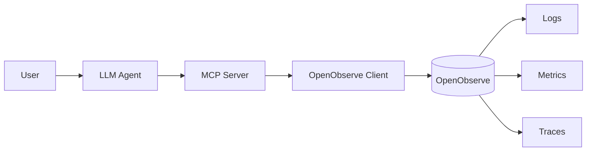

# OpenObserve MCP

A fully working local observability environment where a natural-language question is answered by an LLM agent that
selects MCP tools, which call OpenObserve through a clean abstraction layer.



The LLM never sees OpenObserve URLs, stream names, SQL dialect, authentication, or HTTP details. Those live behind the
MCP server.

---

## 1. Architecture

| Component              | Path              | Responsibility                                               |
|------------------------|-------------------|--------------------------------------------------------------|
| `mcp-server`           | `cmd/mcp-server`  | Speaks MCP over stdio. Exposes typed observability tools.    |
| `agent`                | `cmd/agent`       | Connects to the MCP server, picks tools, returns answers.    |
| `seed`                 | `cmd/seed`        | Loads deterministic sample data via OpenObserve ingestion.   |
| `internal/openobserve` | client + adapters | The ONLY place OpenObserve URLs, auth, SQL, and HTTP live.   |
| `internal/mcp`         | tool registration | Tool schemas, parameter validation, structured logging.      |
| `internal/agent`       | LLM loop          | Anthropic Messages API; tool-use loop; tool-result plumbing. |
| `internal/config`      | typed config      | Env-var parsing + fail-fast validation.                      |

---

## 2. Prerequisites

- Go **1.22+**
- Docker with Compose
- An Anthropic API key (for the agent). Not needed for the MCP server.

---

## 3. Setup

```bash
cp .env.example .env       # then edit if you changed credentials

make up                     # starts OpenObserve, waits for /healthz
make seed                   # loads ~500 logs, 120 metrics, 60 spans
```

The seed utility is **deterministic** — re-running it produces the same shape of data so queries are reproducible.

---

## 4. Environment variables

| Variable               | Default                     | Purpose                        |
|------------------------|-----------------------------|--------------------------------|
| `OPENOBSERVE_URL`      | `http://localhost:5080`     | OpenObserve base URL.          |
| `OPENOBSERVE_ORG`      | `default`                   | Organization / tenant.         |
| `OPENOBSERVE_USERNAME` | `root@example.com`          | HTTP basic auth username.      |
| `OPENOBSERVE_PASSWORD` | `Complexpass#123`           | HTTP basic auth password.      |
| `OPENOBSERVE_TIMEOUT`  | `30s`                       | HTTP request timeout.          |
| `MCP_LOG_FILE`         | (empty = stderr)            | Optional JSON log file path.   |
| `ANTHROPIC_API_KEY`    | (required for agent)        | API key for the LLM.           |
| `ANTHROPIC_MODEL`      | `claude-3-5-sonnet-latest`  | Model name.                    |
| `ANTHROPIC_BASE_URL`   | `https://api.anthropic.com` | Override for proxies.          |

The MCP server only loads `OPENOBSERVE_*`; the LLM agent loads both.

---

## 5. Running the pieces

### MCP server (stdio)

```bash
make build
make mcp                       # serves MCP over stdio
```

The MCP server is meant to be launched by an MCP client as a subprocess — see the agent.

### LLM agent (interactive)

```bash
export ANTHROPIC_API_KEY=sk-...
make agent                     # starts an interactive REPL
```

### One-shot question

```bash
make build
MCP_SERVER_BIN=$(pwd)/bin/mcp-server ANTHROPIC_API_KEY=sk-... \
    go run ./cmd/agent -q "Which service has the most errors?"
```

The agent:

1. launches the MCP server as a subprocess
2. calls `tools/list` to discover capabilities
3. sends the question + tool schemas to Anthropic
4. executes any `tool_use` blocks by calling the MCP server
5. feeds tool results back to the model
6. prints the model's natural-language answer

---

## 6. MCP tools exposed

| Tool                 | Purpose                                                   |
|----------------------|-----------------------------------------------------------|
| `search_logs`        | Filtered log search (service, level, status, message, …). |
| `get_recent_logs`    | Most recent logs, optionally filtered.                    |
| `search_errors`      | Convenience: ERROR-level logs.                            |
| `query_metrics`      | Aggregation over a metric (`avg`, `p95`, `p99`, …).       |
| `get_metric`         | Recent samples for a specific metric.                     |
| `search_traces`      | Span search by service/operation/status.                  |
| `get_trace`          | All spans for a given `trace_id`.                         |
| `get_service_errors` | Error count per service.                                  |
| `get_slow_requests`  | Requests exceeding a duration threshold.                  |
| `get_error_summary`  | Total errors + per-service and per-status breakdown.      |

Each tool has a typed JSON schema; the model only sees these names, descriptions, and typed parameters.

---

## 7. Example end-to-end flows

The LLM translates a question into a single MCP tool call. Examples:

| Natural-language question                           | MCP tool invoked     |
|-----------------------------------------------------|----------------------|
| "Show me the latest errors."                        | `get_recent_logs`    |
| "How many HTTP 500 errors in the last hour?"        | `search_errors`      |
| "Slowest requests in the last hour."                | `get_slow_requests`  |
| "Average `http_request_duration_ms` for `payment`?" | `query_metrics`      |
| "Find traces related to failed payment requests."   | `search_traces`      |
| "Show me checkout requests above 2 seconds."        | `search_logs`        |
| "Which service has the most errors?"                | `get_service_errors` |

The MCP tool:

1. validates the parameters,
2. builds the appropriate OpenObserve SQL inside `internal/openobserve`,
3. hits the v2 search endpoint via HTTP basic auth,
4. returns a JSON result that the LLM uses to compose its answer.

---

## 8. Running tests

### Unit tests

```bash
make test
```

Covers configuration validation, query construction, parameter validation, response parsing, tool registration, and tool
invocation against a fake HTTP server.

### Integration tests

These require a real OpenObserve container.

```bash
make up
make seed
make test-integration
```

Tests live under `tests/integration/` and are gated by the `integration`
build tag. They exercise the real MCP server as a subprocess and verify end-to-end ingestion + search.

---

## 9. Project layout

```text
.
├── cmd/
│   ├── mcp-server/      # MCP server (stdio)
│   ├── agent/           # LLM agent
│   └── seed/            # deterministic data loader
├── internal/
│   ├── config/          # typed env-driven config
│   ├── openobserve/     # the ONLY place OpenObserve details live
│   │   ├── client.go    # HTTP client + auth + URL building
│   │   ├── logs.go      # log search + ingest
│   │   ├── metrics.go   # metric aggregation + ingest
│   │   └── traces.go    # span search + ingest
│   ├── mcp/             # MCP server + tool schemas
│   └── agent/           # LLM tool-use loop
├── scripts/verify/      # E2E transcript driver (no LLM key needed)
├── tests/integration/   # build-tagged E2E tests
├── docker-compose.yml
├── .env.example
├── Makefile
├── go.mod / go.sum
└── README.md
```

---

## 10. Troubleshooting

| Symptom                                                | Cause / fix                                                                     |
|--------------------------------------------------------|---------------------------------------------------------------------------------|
| `openobserve not healthy` warning                      | Container still starting. `make up` waits up to ~60s.                           |
| `missing required configuration: OPENOBSERVE_PASSWORD` | Set the variable in `.env` (or rely on default).                                |
| `401 unauthorized`                                     | Wrong credentials. The default bootstrap user only exists with a fresh volume.  |
| `anthropic: 401`                                       | Missing/invalid `ANTHROPIC_API_KEY`.                                            |
| MCP server hangs                                       | Check that `OPENOBSERVE_URL` is reachable from the agent process.               |
| Empty query results                                    | Seed data may be outside your window; use `since=24h`.                          |
| `docker compose up -d` returns EOF                     | Docker daemon not running.                                                      |

---

## 11. Security considerations

- No credentials live in source. `.env.example` documents defaults, and the real `.env` is git-ignored.
- The MCP server uses HTTP basic auth. In production, replace the default bootstrap user and disable the
  `/api/<org>/<stream>/_json`
  public ingestion (set `ZO_INGEST_ALLOWLIST` etc.).
- The agent does not log the OpenObserve password or the Anthropic key. Structured logs only carry `tool`,
  `duration_ms`, and error messages.
- The LLM never sees raw OpenObserve URLs or SQL.
- Set `MCP_LOG_FILE` to a path inside a directory with restricted permissions if you want logs kept off stderr.

---

## 12. Acceptance verification

The repository was designed to satisfy every checkbox in section 19 of the project brief. To re-run the full
verification:

```bash
make build
make test                   # unit tests
make up                     # OpenObserve + healthcheck
make seed                   # load sample data
make test-integration       # exercise real MCP over real OpenObserve
MCP_SERVER_BIN=$(pwd)/bin/mcp-server \
  ANTHROPIC_API_KEY=sk-... \
  bin/agent -q "Which service has the most errors?"
```

Run `make verify` to print a sample end-to-end transcript of natural-language queries against the live MCP server (no
LLM key required).