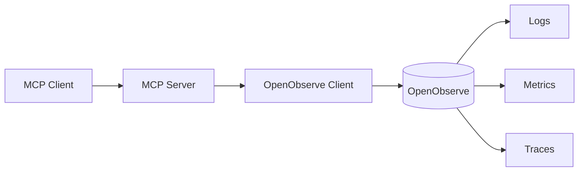

# OpenObserve MCP

A working local observability environment where any MCP-compatible client (Claude Desktop, Cursor, Continue, etc.) calls a clean abstraction layer that talks to OpenObserve.



The client never sees OpenObserve URLs, stream names, SQL dialect, authentication, or HTTP details. Those live behind the MCP server.

---

## 1. Architecture

| Component              | Path              | Responsibility                                               |
|------------------------|-------------------|--------------------------------------------------------------|
| `mcp-server`           | `cmd/mcp-server`  | Speaks MCP over stdio. Exposes typed observability tools.    |
| `seed`                 | `cmd/seed`        | Loads deterministic sample data via OpenObserve ingestion.   |
| `internal/openobserve` | client + adapters | The ONLY place OpenObserve URLs, auth, SQL, and HTTP live.   |
| `internal/mcp`         | tool registration | Tool schemas, parameter validation, structured logging.      |
| `internal/config`      | typed config      | Env-var parsing + fail-fast validation.                      |

---

## 2. Prerequisites

- Go **1.22+**
- Docker with Compose

---

## 3. Setup

```bash
cp .env.example .env       # then edit if you changed credentials

make up                     # starts OpenObserve, waits for /healthz
make seed                   # loads ~500 logs, 120 metrics, 60 spans
```

The seed utility is **deterministic** — re-running it produces the same shape of data so queries are reproducible. Re-running appends; to reset, drop the OpenObserve volume (`make clean` then `make up seed`).

---

## 4. Environment variables

| Variable               | Default                     | Purpose                        |
|------------------------|-----------------------------|--------------------------------|
| `OPENOBSERVE_URL`      | `http://localhost:5080`     | OpenObserve base URL.          |
| `OPENOBSERVE_ORG`      | `default`                   | Organization / tenant.         |
| `OPENOBSERVE_USERNAME` | `root@example.com`          | HTTP basic auth username.      |
| `OPENOBSERVE_PASSWORD` | `Complexpass#123`           | HTTP basic auth password.      |
| `OPENOBSERVE_TIMEOUT`  | `30s`                       | HTTP request timeout.          |
| `MCP_LOG_FILE`         | (empty = stderr)            | Optional JSON log file path.   |

---

## 5. Running the MCP server

```bash
make build
make mcp                       # serves MCP over stdio
```

The MCP server is meant to be launched by an MCP client as a subprocess. Configure your client to run `bin/mcp-server` (or `go run ./cmd/mcp-server`) and point it at the OpenObserve instance you started with `make up`.

---

## 6. MCP tools exposed

| Tool                 | Purpose                                                   |
|----------------------|-----------------------------------------------------------|
| `search_logs`        | Filtered log search (service, level, status, message, …). |
| `get_recent_logs`    | Most recent logs, optionally filtered.                    |
| `search_errors`      | Convenience: ERROR-level logs.                            |
| `query_metrics`      | Aggregation over a metric (`avg`, `p95`, `p99`, …).       |
| `get_metric`         | Average value of a metric across a time window.           |
| `search_traces`      | Span search by service/operation/status.                  |
| `get_trace`          | All spans for a given `trace_id`.                         |
| `get_service_errors` | Error count per service.                                  |
| `get_slow_requests`  | Requests exceeding a duration threshold.                  |
| `get_error_summary`  | Total errors + per-service and per-status breakdown.      |

Each tool has a typed JSON schema; the client only sees these names, descriptions, and typed parameters.

---

## 7. How a tool call flows

To answer a question, the MCP server:

1. validates the parameters,
2. builds the appropriate OpenObserve SQL inside `internal/openobserve`,
3. hits the `/_search` endpoint via HTTP basic auth,
4. returns a JSON result that the client uses to compose its answer.

The MCP layer is the only place that knows about OpenObserve.

---

## 8. Project layout

```text
.
├── cmd/
│   ├── mcp-server/      # MCP server (stdio)
│   └── seed/            # deterministic data loader
├── internal/
│   ├── config/          # typed env-driven config
│   ├── openobserve/     # the ONLY place OpenObserve details live
│   │   ├── client.go    # HTTP client + auth + URL building
│   │   ├── logs.go      # log search + ingest
│   │   ├── metrics.go   # metric aggregation + ingest
│   │   └── traces.go    # span search + ingest
│   └── mcp/             # MCP server + tool schemas
├── docker-compose.yml
├── .env.example
├── Makefile
├── go.mod / go.sum
└── README.md
```

---

## 9. Troubleshooting

| Symptom                                                | Cause / fix                                                                     |
|--------------------------------------------------------|---------------------------------------------------------------------------------|
| `openobserve not healthy` warning                      | Container still starting. `make up` waits up to ~60s.                           |
| `missing required configuration: OPENOBSERVE_PASSWORD` | Set the variable in `.env` (or rely on default).                                |
| `401 unauthorized`                                     | Wrong credentials. The default bootstrap user only exists with a fresh volume.  |
| MCP server hangs                                       | Check that `OPENOBSERVE_URL` is reachable from the MCP server process.          |
| Empty query results                                    | Seed data may be outside your window; use `since=24h`.                          |
| `docker compose up -d` returns EOF                     | Docker daemon not running.                                                      |

---

## 10. Security considerations

- No credentials live in source. `.env.example` documents defaults, and the real `.env` is git-ignored.
- The MCP server uses HTTP basic auth. In production, replace the default bootstrap user and disable the
  `/api/<org>/<stream>/_json`
  public ingestion (set `ZO_INGEST_ALLOWLIST` etc.).
- Structured logs only carry `tool`, `duration_ms`, and error messages — no secrets.
- The MCP client never sees raw OpenObserve URLs or SQL.
- Set `MCP_LOG_FILE` to a path inside a directory with restricted permissions if you want logs kept off stderr.

---

## 11. Acceptance verification

The repository was designed to satisfy every checkbox in section 19 of the project brief. To re-run the full
verification:

```bash
make build
make up                     # OpenObserve + healthcheck
make seed                   # load sample data
./bin/mcp-server            # start MCP server, then connect any MCP client
```